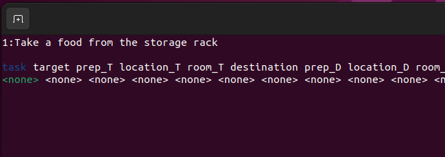
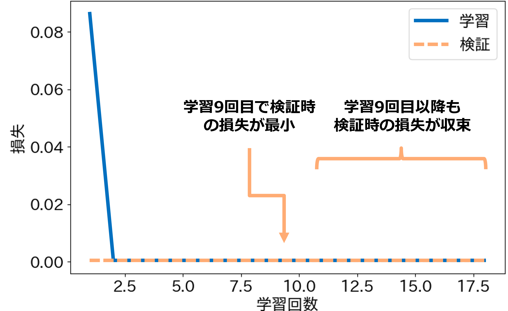
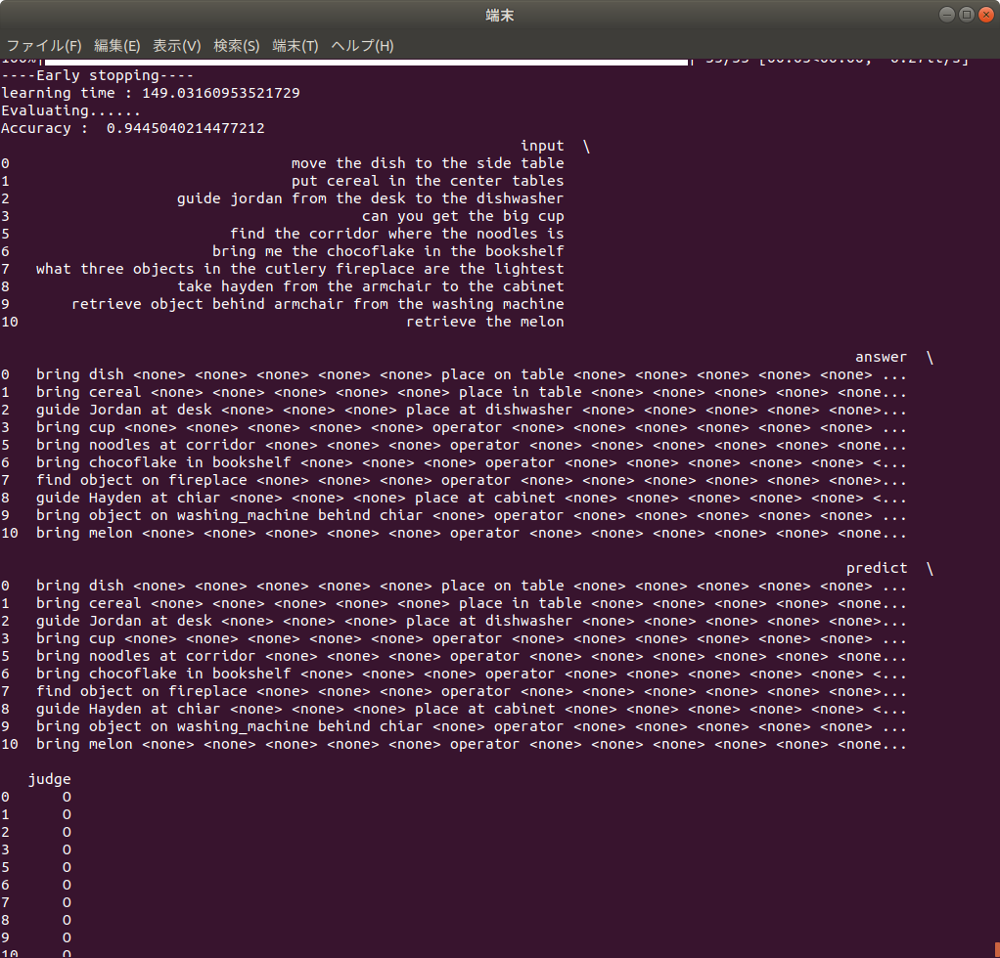
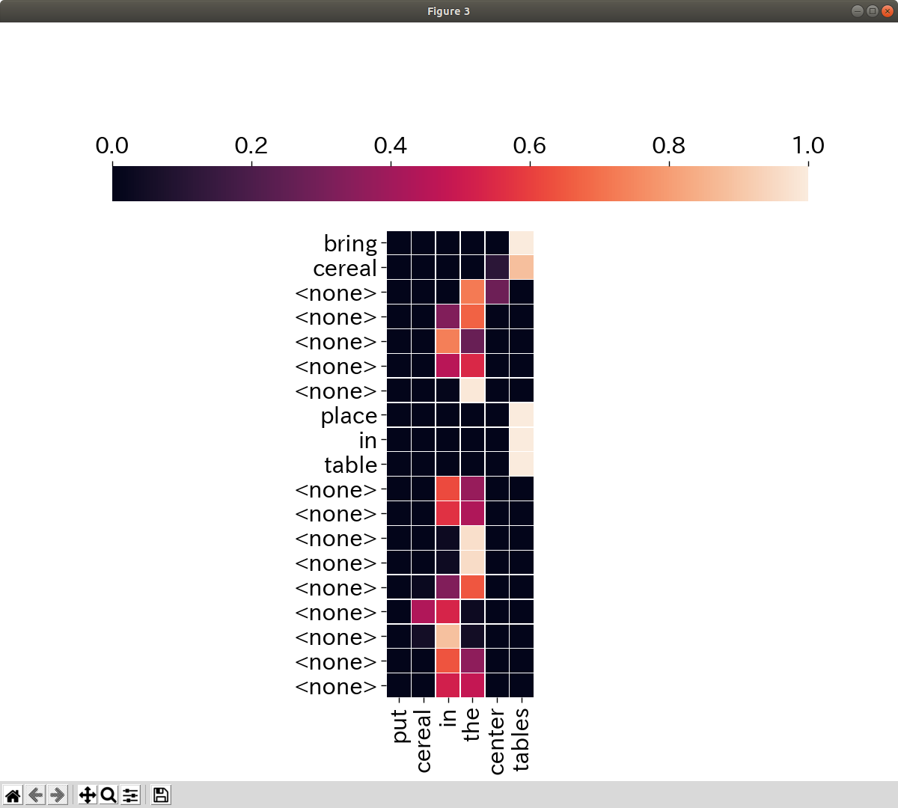

<a name="readme-top"></a>

[JA](README.md) | [EN](README_en.md)

[![Contributors][contributors-shield]][contributors-url]
[![Forks][forks-shield]][forks-url]
[![Stargazers][stars-shield]][stars-url]
[![Issues][issues-shield]][issues-url]
[![License][license-shield]][license-url]

# Command Analyzer Seq2Seq

<!-- TABLE OF CONTENTS -->
<details>
  <summary>Table of Contents</summary>
  <ol>
    <li>
      <a href="#introduction">Introduction</a>
    </li>
    <li>
      <a href="#getting-started">Getting Started</a>
      <ul>
        <li><a href="#prerequisites">Prerequisites</a></li>
        <li><a href="#installation">Installation</a></li>
      </ul>
    </li>
    <li><a href="#create-your-own-dataset">Create your own dataset</a></li>
    <li><a href="#learning-and-inference-process">Learning and inference process</a></li>
    <li><a href="#launch-and-usage">Launch and Usage</a></li>
    <li><a href="#output-information">Output Information</a></li>
    <li><a href="#milestone">Milestone</a></li>
    <!-- <li><a href="#contributing">Contributing</a></li> -->
    <!-- <li><a href="#license">License</a></li> -->
    <li><a href="#acknowledgments">Acknowledgments</a></li>
  </ol>
</details>


<!-- INTRODUCTION -->
## Introduction

This repository performs the command recognition for RoboCup @Home GPSR(General Purpose Service Robot).

<p align="right">(<a href="#readme-top">back to top</a>)</p>


<!-- GETTING STARTED -->
## Getting Started

This section describes how to set up this repository.

<p align="right">(<a href="#readme-top">back to top</a>)</p>


### Prerequisites

First, please set up the following environment before proceeding to the next installation stage.

| System | Version |
| ------ | ------- |
| Ubuntu      | 20.04 (Focal Fossa) |
| ROS         | Noetic Ninjemys     |
| Python      | 3.8                 |
| PyTorch     | <= 1.13             |
| torchtext   | <= 0.14             |
| torchaudio  | <= 0.13             |
| torchvision | <= 0.14             |

> [!NOTE]
> If you need to install `ROS` or `PyTorch`, please check our [SOBITS Manual](https://github.com/TeamSOBITS/sobits_manual/tree/main/install_sh).

<p align="right">(<a href="#readme-top">back to top</a>)</p>


### Installation

1. Go to the `src` folder of ROS.
    ```console
    $ roscd
    # Or just use "cd ~/catkin_ws/" and change directory.
    $ cd src/
    ```
2. Clone this repository.
    ```console
    $ git clone https://github.com/TeamSOBITS/command_analyzer
    ```
3. Navigate into the repository.
    ```console
    $ cd command_analyzer/
    ```
4. Install the dependent packages.
    ```console
    $ bash install.sh
    ```
5. Compile the package.
    ```console
    $ roscd
    # Or just use "cd ~/catkin_ws/" and change directory.
    $ catkin_make
    ```

<p align="right">(<a href="#readme-top">back to top</a>)</p>


## Create your own dataset

<details>
<summary>Here we describe about how to create your own dataset</summary>


### List of Files

- [create_label.py](dataset/scripts/create_label.py)
    Program to create correct labels.

- [key_direct.py](dataset/scripts/key_direct.py)
    Program to receive keyboard input from [create_label.py](dataset/scripts/create_label.py).

- [annonymize_dataset.py](dataset/scripts/annonymize_dataset.py)
    Program to anonymize words by type to increase the dataset.

- [increase_dataset.py](dataset/scripts/increase_dataset.py)
    Program to increase the dataset by replacing anonymized words.

- [trim_dataset.py](dataset/scripts/trim_dataset.py)
    Program to trim the size of the dataset.

<p align="right">(<a href="#readme-top">back to top</a>)</p>


### Creating Text Data

This section explains how to create the text data that will be used as input during training.
In this example, we will create text data using the [RoboCup@Home Japan2024 GPSR Command Generator](https://github.com/RoboCupAtHomeJP/CommandGenerator).
If you want to use data from other competitions like Handyman, please prepare it separately.

First, install the command generator.
```console
$ cd ~/catkin_ws/src
$ git clone https://github.com/RoboCupAtHomeJP/CommandGenerator
```

Then, run the command generator.
```console
$ cd  ~/catkin_ws/src/CommandGenerator/CommandGeneratorJP
$ python3 gpsr_commands.py
```

Each time you press a number, a command is generated.
Copy and paste this into an appropriate txt file.
In this example, we will save it in a file called [command.txt](dataset/data/command.txt).

<p align="right">(<a href="#readme-top">back to top</a>)</p>


### Labeling the Correct Answers

This section explains how to label the correct answers in the text data.
We use a program called [create_label.py](dataset/scripts/create_label.py) to create the correct labels.
First, set the file for the text data and the file to save.

Edit the following file:
```console
$ cd  ~/catkin_ws/src/command_analyzer/dataset/scripts/
$ gedit create_label.py
```

Replace lines 25 and 26 of create_label.py with the file name to read and the file name to write.
Set line 28 to `create` if you are creating new correct labels, and `fix` if you are modifying a file that has already been labeled.
```python
data = {}
increase_data = {}
read_file_name = "command.txt"      # << Replace this
write_file_name = "dataset.txt"     # << Replace this

cmd_type = "create"                 # create or fix
```

Run [create_label.py](dataset/scripts/create_label.py).
```console
$ cd  ~/catkin_ws/src/command_analyzer/dataset/scripts/
$ python3 create_label.py
```

When you run it, you will see the following output. Use the up, down, left, and right keys and the Enter key to operate.
Select the type of information with the left and right keys.
Change the correct label of the selected information with the up and down keys.
When you have finished labeling all the information, press the Enter key to move to the next command.

<div align="center"></div>

> [!IMPORTANT]
> You can add or delete options for the correct labels by editing [lists.py](lib/lists.py).

<details><summary> Click here for the rules of the correct labels </summary>

These are rules decided by the GPSR competitors. Please modify them as needed for your competition.

- For commands like `find ~ object`
    - If it does not include meanings like "tell me the name" or "which is the most 〇〇?", set the task to `bring` and the destination to `operator`.

- For `〇〇_table` or `〇〇_chair`
    - Always label them as `table` and `chair`.

- For the preposition `from`
    - If it's about object manipulation, label it as `in`.
    - If it's about a person, label it as `at`.

</details>

You can interrupt the [create_label.py](dataset/scripts/create_label.py) program with `Ctrl＋C`.  
The next time you run [create_label.py](dataset/scripts/create_label.py), you can resume from where you left off. 

<p align="right">(<a href="#readme-top">back to top</a>)</p>


### Increasing the Dataset

This section explains how to increase the dataset you have created.
First, as a preprocessing step for increasing the dataset, we anonymize words.
We use [annonymize_dataset.py](dataset/scripts/annonymize_dataset.py) for word anonymization.

Replace lines 10 and 11 of [annonymize_dataset.py](dataset/scripts/annonymize_dataset.py) with the file name to read and the file name to write.
```python
from lib import lists, dicts

read_file_name = "dataset.txt"                  # << Replace this
write_file_name = "annonymized_dataset.txt"     # << Replace this

person_names = lists.person_names
```

Run [annonymize_dataset.py](dataset/scripts/annonymize_dataset.py).
```console
$ cd  ~/catkin_ws/src/command_analyzer/dataset/scripts/
$ python3 annonymize_dataset.py
```

Next, we increase the dataset. We use [increase_dataset.py](dataset/scripts/increase_dataset.py) to increase the dataset.

Replace lines 12 and 13 of [increase_dataset.py](dataset/scripts/increase_dataset.py) with the file name to read and the file name to write.
```python
from tqdm import tqdm

read_file_name = "annonymized_dataset.txt"      # << Replace this
write_file_name = "increased_dataset.txt"       # << Replace this

person_names = lists.person_names
```

Run [increase_dataset.py](dataset/scripts/increase_dataset.py).
```console
$ cd  ~/catkin_ws/src/command_analyzer/dataset/scripts/
$ python3 increase_dataset.py
```

<p align="right">(<a href="#readme-top">back to top</a>)</p>


### Trimming the Dataset Size

Finally, we will explain how to adjust (trim) the size of the dataset.
In this repository, it is currently necessary to have a dataset size that is divisible by the batch size in order to perform training, so this process is necessary.
We use [trim_dataset.py](dataset/scripts/trim_dataset.py) to trim the dataset size.

Replace lines 5 and 6 of [trim_dataset.py](dataset/scripts/trim_dataset.py) with the file name to read and the file name to write, and line 11 with the size to trim.
```python
from tqdm import tqdm
input_file_name = "increased_dataset.txt"       # << Replace this
output_file_name = "train_1000.txt"             # << Replace this

# Program to trim the dataset size to any number

# Trimming size
trim_size = 1000                                # << Replace this
```

Run [trim_dataset.py](dataset/scripts/trim_dataset.py).
```console
$ cd  ~/catkin_ws/src/command_analyzer/dataset/scripts/
$ python3 trim_dataset.py
```

With these steps, the creation of the dataset is complete.

</details>

<p align="right">(<a href="#readme-top">back to top</a>)</p>


## Learning and inference process

<details>
<summary>Learning and inference process explanation</summary>


### List of Files

- [network.py](scripts/network.py)
    A program where the Seq2Seq (Sequence to Sequence) network class is defined

- [train.py](scripts/train.py)
    A program that actually performs the training

- [test.py](scripts/test.py)
    A program that tests the command understanding accuracy of the trained model

- [predict.py](scripts/predict.py)
    A program that understands commands using the trained model

- [example.py](scripts/example.py)
    A sample program for command understanding

<p align="right">(<a href="#readme-top">back to top</a>)</p>


### Training Process

This section explains the procedure for training. We use a program called [train.py](scripts/train.py) for training.  
First, specify the dataset and set the parameters.

Edit the following file:
```console
$ cd  ~/catkin_ws/src/command_analyzer/scripts/
$ gedit train.py
```

Edit the parameters from line 26 onwards in [train.py](scripts/train.py).
We recommend setting the maximum number of epochs (line 30) to `1` when checking if the training can be performed well, and setting it to `100` once confirmed.
The batch size (line 31) needs to be set to a common divisor of the data sizes for training, validation, and testing.
For example, if you divide 10,000 data into training:validation:testing = 7:1:2, you can set the batch size to 1000, 500, 200, 100, etc.
A smaller batch size increases the time required for training and increases the response to each data, resulting in sensitive learning to details.
A larger batch size reduces the time required for training and decreases the response to each data, resulting in learning that captures the big picture.
Also, if the batch size is too large, there may be a risk of running out of memory depending on the PC's specifications.
Because of these trade-offs, we recommend adjusting each time and learning.

Please switch the flags on lines 39-43 as needed.

Set the **path of the dataset** on lines 45 and 46.
If the dataset is different for training and testing, also set the path in test_path.
If you use one dataset divided for training and testing, or if you do not test, set test_path to `None`.
Set the path of the model on line 47. When saving the model, it will be saved under the `/model/${model path}/` hierarchy.

```python
class CommandAnalyzer():
    def __init__(self) -> None:
        self.device = torch.device("cuda:0" if torch.cuda.is_available() else "cpu")
        # Parameter settings
        self.sen_length = 30
        self.output_len = 20
        self.max_epoch = 100                    # Maximum number of epochs (number of times of learning)
        self.batch_size = 746                   # Batch size (number of data to learn at the same time)
        self.wordvec_size = 300
        self.hidden_size = 650
        self.dropout = 0.5
        self.learning_rate = 0.001
        self.max_grad = 0.25
        self.eval_interval = 20
        self.early_stoping = 10

        self.is_debug = True                    # Flag for whether to output for debugging
        self.is_save_vec = False                # Flag for whether to save the dictionary vector
        self.is_save_model = False              # Flag for whether to save the learning model
        self.is_test_model = True               # Flag for whether to test the model
        self.is_predict_unk = False             # Flag for whether to convert unknown words during inference

        self.train_path = '37300.txt'           # Path of the dataset
        self.test_path = None                   # Path of the dataset when testing with a dataset different from the learning data
        self.model_path = "example"             # Path when saving the model
        self.text_vocab_path = "text_vocab.pth"
        self.label_vocab_path = "label_vocab.pth"
        self.vectors=GloVe(dim=300)                 # GloVe(dim=300) or FastText(language="en")
        
```

Run [train.py](scripts/train.py).
```console
$ cd  ~/catkin_ws/src/command_analyzer/scripts/
$ python3 train.py
```

When you run it, the training will start.
During training, a loss graph like the one below will be displayed.
If the loss value converges to a low value both during training and validation, the training is successful.

<div align="center"></div>

If you are conducting a test, after the training, an output and an Attention Map like the one below will be displayed.
The output shows the understanding accuracy of the test data, 10 successful examples, and 20 failed examples.

<div align="center"></div>

The Attention Map shows which words in the input sentence were focused on when making each output.
As indicated by the color bar at the top, the brighter the color of the square, the more it indicates that the word was focused on.
From these results, you can consider whether the command understanding is being done correctly through proper learning and attention.

<div align="center"></div>

<p align="right">(<a href="#readme-top">back to top</a>)</p>


### Inference

This section explains the procedure for inference.
There are two methods for inference.  
The first method is to evaluate the inference accuracy using test data.
This method performs the same process as the test in the learning program.
We use a program called [test.py](scripts/test.py) for testing.

Edit the parameters from line 27 onwards in [test.py](scripts/test.py).
Set the batch size on line 30 to the same value as during training.
If this is different from the training time, the configuration inside the network will collapse and it will not work properly.
This is the same for all parameters used in the network.

Set the **path of the dataset for inference** on line 40.  
Set the **path of the model to load** on line 42.  
Set the **number of epochs of the model to load** on line 43.
Unless there is a particular reason, set the largest epoch number among the saved models.

```python
class CommandAnalyzer():
    def __init__(self) -> None:
        self.device = torch.device("cuda:0" if torch.cuda.is_available() else "cpu")
        # Parameter settings
        self.sen_length = 30
        self.output_len = 20
        self.batch_size = 746                  # Batch size (number of data to learn at the same time)
        self.wordvec_size = 300
        self.hidden_size = 650
        self.dropout = 0.5
        self.max_grad = 0.25
        self.eval_interval = 20

        self.is_debug = True
        self.is_predict_unk = False

        # Model path
        self.test_path = '37300.txt'            # Path of the dataset
        self.dir_path = os.path.join(os.path.dirname(os.path.abspath(__file__)), '..')
        self.model_path = "example"             # Path of the saved model
        self.model_num = 17                     # Number of epochs of the saved model
        self.encoder_path = "{}/model/{}/encoder_epoch{}.pth".format(self.dir_path, self.model_path, self.model_num)
        self.decoder_path = "{}/model/{}/decoder_epoch{}.pth".format(self.dir_path, self.model_path, self.model_num)
        self.text_vocab_path = "{}/model/{}/text_vocab.pth".format(self.dir_path, self.model_path, self.model_path)
        self.label_vocab_path = "{}/model/{}/label_vocab.pth".format(self.dir_path, self.model_path)
```

Run [test.py](scripts/test.py).
```console
$ cd  ~/catkin_ws/src/command_analyzer/scripts/
$ python3 test.py
```

The execution result is the same as the test in [test.py](scripts/test.py), so it is omitted.

The second method is to understand (infer) the entered command sentence.  
This method performs the inference process as a function.  
We use a program called [predict.py](scripts/predict.py) for inference.

Edit the parameters from line 23 onwards in [predict.py](scripts/predict.py).  
Set the batch size on line 26 to the same value as during training. If this is different from the training time, the configuration inside the network will collapse and it will not work properly. This is the same for all parameters used in the network.

Set the **path of the model to load** on line 39.  
Set the **number of epochs of the model to load** on line 40. Unless there is a particular reason, set the largest epoch number among the saved models.

```python
class CommandAnalyzer():
    def __init__(self) -> None:
        self.device = torch.device("cuda:0" if torch.cuda.is_available() else "cpu")
        # Parameter settings
        self.sen_length = 30
        self.output_len = 20
        self.batch_size = 746                  # Batch size (number of data to learn at the same time)
        self.wordvec_size = 300
        self.hidden_size = 650
        self.dropout = 0.5
        self.learning_rate = 0.001
        self.momentum=0
        self.max_grad = 0.25
        self.eval_interval = 20
        self.predict_unk = True
        self.show_attention_map = True

        # Model path
        self.model_path = "gpsr_2013"
        self.dir_path = os.path.join(os.path.dirname(os.path.abspath(__file__)), '..')
        self.encoder_path = "{}/model/{}/encoder.pth".format(self.dir_path, self.model_path)
        self.decoder_path = "{}/model/{}/decoder.pth".format(self.dir_path, self.model_path)
        self.text_vocab_path = "{}/model/{}/text_vocab.pth".format(self.dir_path, self.model_path)
        self.label_vocab_path = "{}/model/{}/label_vocab.pth".format(self.dir_path, self.model_path)
```

The usage as a function is described from line 154 onwards.  
In this example, the understanding of the command sentence received at line 158 is performed.

Please refer to this writing style when writing the program.

```python
if __name__ == "__main__":
    command_analyzer = CommandAnalyzer()    
    while True:
        try:
            input_str = input("please input command >>")
            # input_str = "bring me the carlsberg in the living room"
            print(input_str)
            result =command_analyzer.predict(input_str)
            print(result)
            break
        except KeyboardInterrupt:
            break
```

Run [predict.py](scripts/predict.py)
```console
$ cd ~/catkin_ws/src/command_analyzer/scripts/
$ python3 predict.py
```

When you run it, you will get an output like the one below.
In this example, we are entering the command "Bring me an apple from the shelf".
You can terminate the program with `Ctrl+C`.

<div align="center"></div>

</details>

<p align="right">(<a href="#readme-top">back to top</a>)</p>


<!-- LAUNCH AND USAGE EXAMPLES -->
## Launch and Usage

Let's start with the execution process.

```console
$ cd ~/catkin_ws/src/command_analyzer/scripts
$ python3 example.py
please input command >>                     # Input Command
```

> [!NOTE]
> Inside [example.py](scripts/example.py), an instance of the `CommandAnalyzer` class is created.
When you pass an input (command sentence) to the `predict` function of the `CommandAnalyzer` class, the recognition result is returned as a dictionary.

<p align="right">(<a href="#readme-top">back to top</a>)</p>


### Output Information

<table>
    <tr>
        <th>Key Value</th>
        <th>Description</th>
        <th>Example</th>
    </tr>
    <tr>
        <td>task</td>
        <td>Task Content</td>
        <td>bring, follow, find</td>
    </tr>
    <tr>
        <td>target</td>
        <td>Target person for the task (object/person)</td>
        <td>apple, Michael, me</td>
    </tr>
    <tr>
        <td>prep_T</td>
        <td>Position of the target object corresponding to the location</td>
        <td>in, on, under</td>
    </tr>
    <tr>
        <td>location_T</td>
        <td>Location of the target object/person</td>
        <td>table, chair, shelf</td>
    </tr>
    <tr>
        <td>room_T</td>
        <td>Room of the target object/person</td>
        <td>living kitchen, bedroom</td>
    </tr>
    <tr>
        <td>destination</td>
        <td>Destination of the task (person/place)</td>
        <td>me, Michael, place​</td>
    </tr>
    <tr>
        <td>prep_D</td>
        <td>Position of the target destination corresponding to the location</td>
        <td>in, on, under</td>
    </tr>
    <tr>
        <td>location_D</td>
        <td>Destination location</td>
        <td>table, chair, shelf</td>
    </tr>
    <tr>
        <td>prep_D</td>
        <td>Position of the target destination corresponding to the location</td>
        <td>in, on, under</td>
    </tr>
    <tr>
        <td>room_D</td>
        <td>Destination Room</td>
        <td>living kitchen, bedroom</td>
    </tr>
    <tr>
        <td>WYS</td>
        <td>Question/Answer contents</td>
        <td>What day is it today?</td>
    </tr>
    <tr>
        <td>gesture</td>
        <td>Person's Gesture information</td>
        <td>waving left arm</td>
    </tr>
    <tr>
        <td>pose</td>
        <td>Person's Pose information</td>
        <td>sitting</td>
    </tr>
    <tr>
        <td>obj_comp</td>
        <td>Object additional information</td>
        <td>largest, heaviest, thinnest</td>
    </tr>
    <tr>
        <td>obj_color</td>
        <td>Object color information</td>
        <td>black, blue</td>
    </tr>
    <tr>
        <td>cloth</td>
        <td>Person's clothes</td>
        <td>T shrit, jacket</td>
    </tr>
    <tr>
        <td>room_F</td>
        <td>Last destintion room</td>
        <td>living kitchen, bedroom</td>
    </tr>
</table>

<p align="right">(<a href="#readme-top">back to top</a>)</p>


<!-- MILESTONE -->
## Milestone

See the [open issues][issues-url] for a full list of proposed features (and known issues).

<p align="right">(<a href="#readme-top">back to top</a>)</p>


<!-- ACKNOWLEDGMENTS -->
## Acknowledgments

- [RCJ24 CommandGenerator](https://github.com/RoboCupAtHomeJP/CommandGenerator/tree/rcj24_for_opl)
- [RCJ24 GPSR](https://github.com/RoboCupAtHomeJP/AtHome2024/blob/main/rules/OPL/gpsr_en.md)

<p align="right">(<a href="#readme-top">back to top</a>)</p>


[contributors-shield]: https://img.shields.io/github/contributors/TeamSOBITS/command_analyzer.svg?style=for-the-badge
[contributors-url]: https://github.com/TeamSOBITS/command_analyzer/graphs/contributors
[forks-shield]: https://img.shields.io/github/forks/TeamSOBITS/command_analyzer.svg?style=for-the-badge
[forks-url]: https://github.com/TeamSOBITS/command_analyzer/network/members
[stars-shield]: https://img.shields.io/github/stars/TeamSOBITS/command_analyzer.svg?style=for-the-badge
[stars-url]: https://github.com/TeamSOBITS/command_analyzer/stargazers
[issues-shield]: https://img.shields.io/github/issues/TeamSOBITS/command_analyzer.svg?style=for-the-badge
[issues-url]: https://github.com/TeamSOBITS/command_analyzer/issues
[license-shield]: https://img.shields.io/github/license/TeamSOBITS/command_analyzer.svg?style=for-the-badge
[license-url]: LICENSE
