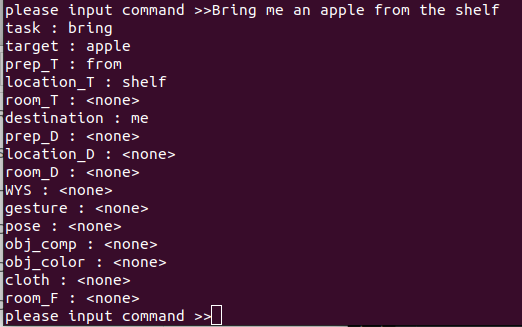

<a name="readme-top"></a>

[JA](README.md) | [EN](README_en.md)

[![Contributors][contributors-shield]][contributors-url]
[![Forks][forks-shield]][forks-url]
[![Stargazers][stars-shield]][stars-url]
[![Issues][issues-shield]][issues-url]
[![License][license-shield]][license-url]

# Command Analyzer Seq2Seq

<!-- 目次 -->
<details>
  <summary>目次</summary>
  <ol>
    <li>
      <a href="#概要">概要</a>
    </li>
    <li>
      <a href="#セットアップ">セットアップ</a>
      <ul>
        <li><a href="#環境条件">環境条件</a></li>
        <li><a href="#Pytorchのバージョン">Pytorchのバージョン</a></li>
        <li><a href="#インストール方法">インストール方法</a></li>
      </ul>
    </li>
    <li>
    　<a href="#データセットの作り方">データセットの作り方</a>
    </li>
    <li>
    　<a href="#学習の回し方と推論">学習の回し方と推論</a>
    </li>
    <li><a href="#実行方法">実行方法</a></li>
    <li><a href="#解説">解説</a></li>
    <!-- <li><a href="#contributing">Contributing</a></li> -->
    <!-- <li><a href="#license">License</a></li> -->
  </ol>
</details>


## 概要

GPSR(General Purpose Service Robot)タスクの命令理解リポジトリ

<p align="right">(<a href="#readme-top">上に戻る</a>)</p>


## セットアップ

ここで，本レポジトリのセットアップ方法について説明します．

<p align="right">(<a href="#readme-top">上に戻る</a>)</p>


### 環境条件

まず，以下の環境を整えてから，次のインストール段階に進んでください．

| System | Version |
| ------ | ------- |
| Ubuntu      | 20.04 (Focal Fossa) |
| ROS         | Noetic Ninjemys     |
| Python      | 3.8                 |
| PyTorch     | <= 1.13             |
| torchtext   | <= 0.14             |
| torchaudio  | <= 0.13             |
| torchvision | <= 0.14             |

> [!NOTE]
> `ROS`や`PyTorch`などのインストール方法については，[SOBITS Manual](https://github.com/TeamSOBITS/sobits_manual/tree/main/install_sh)をご参照ください．

<p align="right">(<a href="#readme-top">上に戻る</a>)</p>


### インストール方法

1. ROSの`src`フォルダに移動します．
   ```sh
   $ roscd
   # もしくは，"cd ~/catkin_ws/"へ移動．
   $ cd src/
   ```
2. 本レポジトリをcloneします．
   ```sh
   $ git clone https://github.com/TeamSOBITS/command_analyzer.git
   ```
3. レポジトリの中へ移動します．
   ```sh
   $ cd command_analyzer/
   ```
4. 依存パッケージをインストールします．
   ```sh
   $ bash install.sh
   ```
> [!WARNING]
> `install.sh`でインストールされるpytorchは使用するPCのGPU，CUDAによってバージョンが異なります. 
公式サイトの手順通りにインストールして下さい．

5. パッケージをコンパイルします．
   ```sh
   $ roscd
   # もしくは，"cd ~/catkin_ws/"へ移動．
   $ catkin_make
   ```

<p align="right">(<a href="#readme-top">上に戻る</a>)</p>


## データセットの作り方

<details>
<summary>データセットの作り方まとめ</summary>


### 各種ファイルについて

- `dataset/scripts/create_label.py`  
    正解ラベルを作成するためのプログラム  

- `dataset/scripts/key_direct.py`  
    `create_label.py`のキーボード入力を受け取るプログラム  

- `dataset/scripts/annonymize_dataset.py`  
    データセット増量のために，単語を種類ごとに匿名化するプログラム  

- `dataset/scripts/increase_dataset.py`  
    匿名化した単語を入れ替えることでデータセットを増量するプログラム  

- `dataset/scripts/trim_dataset.py`  
    データセットのサイズをトリミングするプログラム  

<p align="right">(<a href="#readme-top">上に戻る</a>)</p>


### テキストデータを作成する

学習時の入力となるテキストデータの作成手順を説明します．
今回の例では，[RoboCup@Home Japan2024のGPSRのコマンドジェネレータ](https://github.com/RoboCupAtHomeJP/CommandGenerator)を使用してテキストデータを作成します．
Handyman等，別競技のデータを使いたい場合は別途用意して下さい．

コマンドジェネレータをインストールします．
```console
$ cd ~/catkin_ws/src
$ git clone https://github.com/RoboCupAtHomeJP/CommandGenerator
```

コマンドジェネレータを実行します．
```console
$ cd  ~/catkin_ws/src/CommandGenerator/CommandGeneratorJP
$ python3 gpsr_commands.py
```

番号を押すたびにコマンドが生成されるので，適当なtxtファイルにコピー＆ペーストします．今回の例では，`command.txt`というファイルに保存します．

<p align="right">(<a href="#readme-top">上に戻る</a>)</p>


### 正解ラベルをつける

テキストデータに正解ラベルをつける手順を説明します．
正解ラベルの作成には，`create_label.py`というプログラムを使用します．  
まず，テキストデータのファイルと保存するファイルの設定を行います．

以下のファイルを編集します．
```console
$ cd  ~/catkin_ws/src/command_analyzer/dataset/scripts/
$ gedit create_label.py
```

`create_label.py`の25, 26行目を読み込むファイル名と書き込むファイル名に書き換えます.
28行目の設定は正解ラベルを新規作成する場合`create`，一度正解ラベルがついたファイルを修正する場合`fix`にして下さい．
```create_label.py
data = {}
increase_data = {}
read_file_name = "command.txt"      # << ここを書き換える
write_file_name = "dataset.txt"     # << ここを書き換える

cmd_type = "create"                 # create or fix
```

`create_label.py`を実行します．
```console
$ cd  ~/catkin_ws/src/command_analyzer/dataset/scripts/
$ python3 create_label.py
```
実行すると，以下のような出力がされます．操作は上下左右キーとEnterキーで行います．  
左右キーで情報の種類を選択します．
上下キーで選択している情報の正解ラベルを変更します．  
全ての情報にラベルをつけ終えたら，Enterキーを押すことで次のコマンドに移動します．  

<div align="center"></div>

> [!IMPORTANT]
> 正解ラベルの選択肢は[lists.py](lib/lists.py)を編集することで追加・削除することが出来ます．

<details><summary> 正解ラベルの規則はこちらをクリック </summary>

これはGPSR競技者が決めた規則です．競技等の必要性に応じて変更して下さい．

- `find ~ object`という命令について
    - 「名前を教えて」や「一番〇〇な物はどれ？」などの意味を含まない場合は，タスク：`bring`, 目的地：`operator`とする

- `〇〇_table`や`〇〇_chair`について
    - 一律`table`，`chair`として正解ラベルを付与する

- 前置詞`from`について
    - 物体操作の場合は`in`として正解ラベルを付与する
    - 人を対象とする場合は`at`として正解ラベルを付与する

</details>

`create_label.py`のプログラムは`Ctrl＋C`で中断することが出来ます．  
次回`create_label.py`を実行する際に途中から再開することが出来ます．  

<p align="right">(<a href="#readme-top">上に戻る</a>)</p>


### データの増量をする

作成したデータセットを増量する手順を説明します．まず，データセット増量の前処理として，単語の匿名化を行います．
単語の匿名化には，[annonymize_dataset.py](dataset/scripts/annonymize_dataset.py)を使用します．

[annonymize_dataset.py](dataset/scripts/annonymize_dataset.py)の10, 11行目を読み込むファイル名と書き込むファイル名に書き換えます.
```python
from lib import lists, dicts

read_file_name = "dataset.txt"                  # << ここを書き換える
write_file_name = "annonymized_dataset.txt"     # << ここを書き換える

person_names = lists.person_names
```

[annonymize_dataset.py](dataset/scripts/annonymize_dataset.py)を実行します．
```console
$ cd  ~/catkin_ws/src/command_analyzer/dataset/scripts/
$ python3 annonymize_dataset.py
```

次に，データセットの増量を行います．
データセットの増量には，[increase_dataset.py](dataset/scripts/increase_dataset.py)を使用します．

[increase_dataset.py](dataset/scripts/increase_dataset.py)の12, 13行目を読み込むファイル名と書き込むファイル名に書き換えます.
```python
from tqdm import tqdm

read_file_name = "annonymized_dataset.txt"      # << ここを書き換える
write_file_name = "increased_dataset.txt"       # << ここを書き換える

person_names = lists.person_names
```

[increase_dataset.py](dataset/scripts/increase_dataset.py)を実行します．
```console
$ cd  ~/catkin_ws/src/command_analyzer/dataset/scripts/
$ python3 increase_dataset.py
```

<p align="right">(<a href="#readme-top">上に戻る</a>)</p>


### データサイズをトリミングする

最後にデータセットのサイズを調整(トリミング)する手順を説明します．このリポジトリでは，現状バッチサイズで割り切れるデータサイズでないと学習を行うことが出来ないため，この処理が必要となります．
データサイズのトリミングには[trim_datset.py](dataset/scripts/trim_dataset.py)を使用します．

[trim_datset.py](dataset/scripts/trim_dataset.py)の5，6行目を読み込むファイル名と書き込むファイル名に11行目をトリミングするサイズに書き換えます.
```python
from tqdm import tqdm
input_file_name = "increased_dataset.txt"       # << ここを書き換える
output_file_name = "train_1000.txt"             # << ここを書き換える

# データセットのサイズを任意の数にトリミングするプログラム

# トリミングサイズ
trim_size = 1000                                # << ここを書き換える
```

[trim_datset.py](dataset/scripts/trim_dataset.py)を実行します．
```console
$ cd  ~/catkin_ws/src/command_analyzer/dataset/scripts/
$ python3 trim_datset.py
```

以上の手順でデータセットの作成は完了です．

</details>

<p align="right">(<a href="#readme-top">上に戻る</a>)</p>


## 学習の回し方と推論

<details>
<summary>学習のまとめ</summary>


### 各種ファイルについて

- `scripts/network.py`  
    Seq2Seq(Sequence to Sequence)ネットワークのクラスが記述されたプログラム  

- `scripts/train.py`  
    実際に学習を行うプログラム  

- `scripts/test.py`  
    学習したモデルの命令理解精度をテストするプログラム  

- `scripts/predict.py`  
    学習したモデルで命令を理解するプログラム  

- `scripts/example.py`  
    命令理解のサンプルプログラム  

<p align="right">(<a href="#readme-top">上に戻る</a>)</p>


### 学習する

学習を行う手順を説明します．
学習には[train.py](scripts/train.py)というプログラムを使用します．  
まず，データセットの指定とパラメータの設定を行います．

以下のファイルを編集します．
```console
$ cd  ~/catkin_ws/src/command_analyzer/scripts/
$ gedit train.py
```

[train.py](scripts/train.py)の26行目以降のパラメータを編集します．  
30行目のエポック数の最大値は学習を上手く回すことが出来るか確認する際は`1`に設定し，確認が出来たら`100`に設定することをオススメします．  
31行目のバッチサイズは学習，検証，テストで使うデータセットそれぞれのデータサイズの公約数に設定する必要があります．
例えば，10000データを学習：検証：テスト=7:1:2で分割する場合，バッチサイズは1000，500，200，100などに設定することができます．
バッチサイズは小さいと学習にかかる時間が長くなり，1つ1つのデータに対する反応が上がり，細部に敏感な学習をします．
バッチサイズは大きいと学習にかかる時間が短くなり，1つ1つのデータに対する反応が下がり，大枠で捉えた学習をします．
また，バッチサイズが大きすぎるとPCのスペックによってはメモリ不足になる可能性もあります．
このようなトレードオフがあるため，都度調整をして学習することをオススメします． 

39-43行目のフラッグは各種必要に応じて切り替えて下さい．

45, 46行目には**データセットのパス**を設定します．
学習時とテスト時でデータセットが異なる場合は，test_pathにもパスを設定します．
1つのデータセットを学習時とテスト時に分けて用いる場合，あるいはテストを行わない場合はtest_pathは`None`と設定します．  
47行目にはモデルのパスを設定します．モデルを保存する際は，`/model/${モデルパス}/`の階層下に保存されます．

```python
class CommandAnalyzer():
    def __init__(self) -> None:
        self.device = torch.device("cuda:0" if torch.cuda.is_available() else "cpu")
        # パラメータ設定
        self.sen_length = 30
        self.output_len = 20
        self.max_epoch = 100                    # エポック数(学習回数)の最大値
        self.batch_size = 746                   # バッチサイズ(同時に学習するデータの数)
        self.wordvec_size = 300
        self.hidden_size = 650
        self.dropout = 0.5
        self.learning_rate = 0.001
        self.max_grad = 0.25
        self.eval_interval = 20
        self.early_stoping = 10

        self.is_debug = True                    # デバッグ用の出力をするかのフラッグ
        self.is_save_vec = False                # 辞書ベクトルを保存するかどうかのフラッグ
        self.is_save_model = False              # 学習モデルを保存するかどうかのフラッグ
        self.is_test_model = True               # モデルのテストを行うかどうかのフラッグ
        self.is_predict_unk = False             # 推論時に未知語を変換するかどうかのフラッグ

        self.train_path = '37300.txt'           # データセットのパス
        self.test_path = None                   # 学習データと別のデータセットでテストを行う際のデータセットのパス
        self.model_path = "example"             # モデルを保存する際のパス
        self.text_vocab_path = "text_vocab.pth"
        self.label_vocab_path = "label_vocab.pth"
        self.vectors=GloVe(dim=300)                 # GloVe(dim=300) or FastText(language="en")
        
```

[train.py](scripts/train.py)を実行します．
```console
$ cd  ~/catkin_ws/src/command_analyzer/scripts/
$ python3 train.py
```

実行すると，学習が始まります．
学習中は以下のような損失グラフが表示されます．
損失の値が，学習時と検証時共に低い値で収束していたら学習成功です．

<div align="center"></div>

テストを行う場合，学習後に以下のような出力とAttentionマップが表示されます．
出力はテストデータの理解精度と，成功例10個，失敗例20個を示します．

<div align="center"></div>

Attentionマップは各出力をする際に入力文中のどの単語に注目をしていたかを示すものです．
上部のカラーバーに示すように，マスの色が明るければ明るいほど，その単語に注目をしていることを示しています．
この結果から正しい学習・注目による命令理解が出来ているか考察することができます．

<div align="center"></div>

<p align="right">(<a href="#readme-top">上に戻る</a>)</p>


### 推論する

推論を行う手順を説明します．
推論の方法は2種類あります．  
1つ目は，テストデータを用いて推論精度の評価を行う方法です．
この方法は，学習時のプログラムにおけるテストと同じ処理を行います．
テストには[test.py](scripts/test.py)というプログラムを使用します．

[test.py](scripts/test.py)の27行目以降のパラメータを編集します．  
30行目のバッチサイズを学習時と同じ値に設定します．
これが学習時と異なる場合，ネットワーク内の構成が崩れるため，上手く動作しません．
これは，ネットワークに用いるパラメータであれば全て同様です．

40行目は**推論するデータセットのパス**を設定します．
42行目は**読み込むモデルのパス**を設定します．
43行目は**読み込むモデルのエポック数**を設定します．
特に理由がない限りは，保存されているモデルの中で一番大きいエポック数を設定しましょう．

```python
class CommandAnalyzer():
    def __init__(self) -> None:
        self.device = torch.device("cuda:0" if torch.cuda.is_available() else "cpu")
        # パラメータ設定
        self.sen_length = 30
        self.output_len = 20
        self.batch_size = 746                  # バッチサイズ(同時に学習するデータの数)
        self.wordvec_size = 300
        self.hidden_size = 650
        self.dropout = 0.5
        self.max_grad = 0.25
        self.eval_interval = 20

        self.is_debug = True
        self.is_predict_unk = False

        # モデルのパス
        self.test_path = '37300.txt'            # データセットのパス
        self.dir_path = os.path.join(os.path.dirname(os.path.abspath(__file__)), '..')
        self.model_path = "example"             # 保存したモデルのパス
        self.model_num = 17                     # 保存したモデルのエポック数
        self.encoder_path = "{}/model/{}/encoder_epoch{}.pth".format(self.dir_path, self.model_path, self.model_num)
        self.decoder_path = "{}/model/{}/decoder_epoch{}.pth".format(self.dir_path, self.model_path, self.model_num)
        self.text_vocab_path = "{}/model/{}/text_vocab.pth".format(self.dir_path, self.model_path, self.model_path)
        self.label_vocab_path = "{}/model/{}/label_vocab.pth".format(self.dir_path, self.model_path)
```

[test.py](scripts/test.py)を実行します．
```console
$ cd  ~/catkin_ws/src/command_analyzer/scripts/
$ python3 test.py
```
実行結果は，[test.py](scripts/test.py)のテスト行こうと同じであるため割愛します．

2つ目は，入力された命令文を理解(推論)する方法です．
この方法は，推論の処理を関数化して行います．
推論には[predict.py](scripts/predict.py)というプログラムを使用します．

[predict.py](scripts/predict.py)の23行目以降のパラメータを編集します．  
26行目のバッチサイズを学習時と同じ値に設定します．
これが学習時と異なる場合，ネットワーク内の構成が崩れるため，上手く動作しません．
これは，ネットワークに用いるパラメータであれば全て同様です．

39行目は**読み込むモデルのパス**を設定します．
40行目は**読み込むモデルのエポック数**を設定します．
特に理由がない限りは，保存されているモデルの中で一番大きいエポック数を設定しましょう．

```python
class CommandAnalyzer():
    def __init__(self) -> None:
        self.device = torch.device("cuda:0" if torch.cuda.is_available() else "cpu")
        # パラメータ設定
        self.sen_length = 30
        self.output_len = 20
        self.batch_size = 746                  # バッチサイズ(同時に学習するデータの数)
        self.wordvec_size = 300
        self.hidden_size = 650
        self.dropout = 0.5
        self.learning_rate = 0.001
        self.momentum=0
        self.max_grad = 0.25
        self.eval_interval = 20
        self.predict_unk = True
        self.show_attention_map = True

        # モデルのパス
        self.model_path = "gpsr_2013"
        self.dir_path = os.path.join(os.path.dirname(os.path.abspath(__file__)), '..')
        self.encoder_path = "{}/model/{}/encoder.pth".format(self.dir_path, self.model_path)
        self.decoder_path = "{}/model/{}/decoder.pth".format(self.dir_path, self.model_path)
        self.text_vocab_path = "{}/model/{}/text_vocab.pth".format(self.dir_path, self.model_path)
        self.label_vocab_path = "{}/model/{}/label_vocab.pth".format(self.dir_path, self.model_path)
```


関数としての使い方は154行目以降に記載しています．
この例では，158行目で受け取ったした命令文の理解を行います．

プログラムに書き込む際はこの書き方を参考にして下さい．
```python
if __name__ == "__main__":
    command_analyzer = CommandAnalyzer()    
    while True:
        try:
            input_str = input("please input command >>")
            # input_str = "bring me the carlsberg in the living room"
            print(input_str)
            result =command_analyzer.predict(input_str)
            print(result)
            break
        except KeyboardInterrupt:
            break
```

[predict.py](scripts/predict.py)を実行します．
```console
$ cd ~/catkin_ws/src/command_analyzer/scripts/
$ python3 predict.py
```

実行すると，以下のような出力が得られます．
この例では，`Bring me an apple from the shelf`という命令文を入力しています．
プログラムは`Ctrl+C`で終了することができます．

<div align="center"></div>

</details>

<p align="right">(<a href="#readme-top">上に戻る</a>)</p>


## 実行方法

```console
$ cd ~/catkin_ws/src/command_analyzer/scripts
$ python3 example.py
please input command >>                     # 命令文を入力する
```
> [!NOTE]
> [example.py](scripts/example.py)の内部では`CommandAnalyzer`クラスのインスタンスが生成される. `CommandAnalyzer`クラスの`predict`関数に入力(命令文)を渡すと，認識結果が辞書型で返されます．

<p align="right">(<a href="#readme-top">上に戻る</a>)</p>


### 出力情報の説明

<table>
    <tr>
        <th>キー値</th>
        <th>説明</th>
        <th>値の例</th>
    </tr>
    <tr>
        <td>task</td>
        <td>タスクの内容</td>
        <td>bring, follow, find</td>
    </tr>
    <tr>
        <td>target</td>
        <td>タスクを行う対象(物体または人)</td>
        <td>apple, Michael, me</td>
    </tr>
    <tr>
        <td>prep_T</td>
        <td>場所に対応する対象の位置関係</td>
        <td>in, on, under</td>
    </tr>
    <tr>
        <td>location_T</td>
        <td>対象のある(いる)場所</td>
        <td>table, chair, shelf</td>
    </tr>
    <tr>
        <td>room_T</td>
        <td>対象のある(いる)部屋</td>
        <td>living kitchen, bedroom</td>
    </tr>
    <tr>
        <td>destination</td>
        <td>タスクでの対象の行先(人または場所)</td>
        <td>me, Michael, place​</td>
    </tr>
    <tr>
        <td>prep_D</td>
        <td>場所に対応する行先の位置関係</td>
        <td>in, on, under</td>
    </tr>
    <tr>
        <td>location_D</td>
        <td>行先の場所</td>
        <td>table, chair, shelf</td>
    </tr>
    <tr>
        <td>prep_D</td>
        <td>場所に対応する行先の位置関係</td>
        <td>in, on, under</td>
    </tr>
    <tr>
        <td>room_D</td>
        <td>行先の部屋</td>
        <td>living kitchen, bedroom</td>
    </tr>
    <tr>
        <td>WYS</td>
        <td>人に質問(回答)するときの内容</td>
        <td>What day is it today?</td>
    </tr>
    <tr>
        <td>gesture</td>
        <td>人のジェスチャー情報</td>
        <td>waving left arm</td>
    </tr>
    <tr>
        <td>pose</td>
        <td>人のポーズ情報</td>
        <td>sitting</td>
    </tr>
    <tr>
        <td>obj_comp</td>
        <td>物体の補足情報</td>
        <td>largest, heaviest, thinnest</td>
    </tr>
    <tr>
        <td>obj_color</td>
        <td>対象物体の色情報</td>
        <td>black, blue</td>
    </tr>
    <tr>
        <td>cloth</td>
        <td>人の服装</td>
        <td>T shrit, jacket</td>
    </tr>
    <tr>
        <td>room_F</td>
        <td>最終目的地の部屋</td>
        <td>living kitchen, bedroom</td>
    </tr>
</table>

<p align="right">(<a href="#readme-top">上に戻る</a>)</p>


<!-- マイルストーン -->
## マイルストーン

現時点のバッグや新規機能の依頼を確認するために[Issueページ][issues-url]をご覧ください．

<p align="right">(<a href="#readme-top">上に</a>)</p>


<!-- 参考文献 -->
## 参考文献

- [RCJ24 CommandGenerator](https://github.com/RoboCupAtHomeJP/CommandGenerator/tree/rcj24_for_opl)
- [RCJ24 GPSR](https://github.com/RoboCupAtHomeJP/AtHome2024/blob/main/rules/OPL/gpsr_ja.md)

<p align="right">(<a href="#readme-top">上に戻る</a>)</p>


[contributors-shield]: https://img.shields.io/github/contributors/TeamSOBITS/command_analyzer.svg?style=for-the-badge
[contributors-url]: https://github.com/TeamSOBITS/command_analyzer/graphs/contributors
[forks-shield]: https://img.shields.io/github/forks/TeamSOBITS/command_analyzer.svg?style=for-the-badge
[forks-url]: https://github.com/TeamSOBITS/command_analyzer/network/members
[stars-shield]: https://img.shields.io/github/stars/TeamSOBITS/command_analyzer.svg?style=for-the-badge
[stars-url]: https://github.com/TeamSOBITS/command_analyzer/stargazers
[issues-shield]: https://img.shields.io/github/issues/TeamSOBITS/command_analyzer.svg?style=for-the-badge
[issues-url]: https://github.com/TeamSOBITS/command_analyzer/issues
[license-shield]: https://img.shields.io/github/license/TeamSOBITS/command_analyzer.svg?style=for-the-badge
[license-url]: LICENSE
