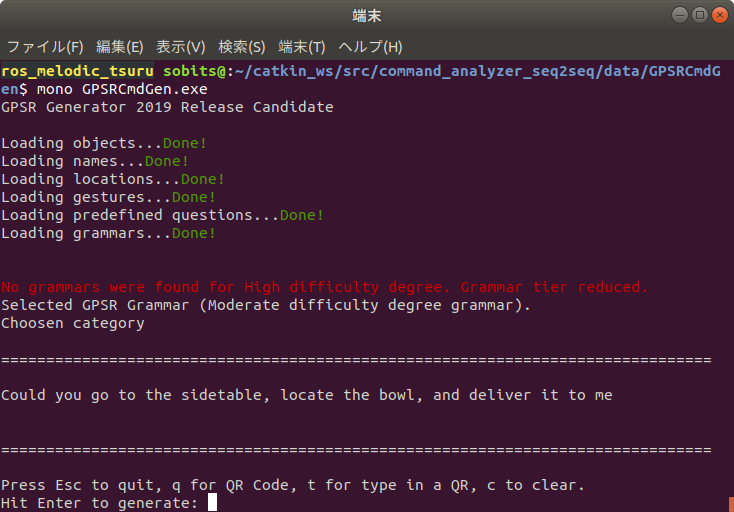

# Command Analyzer Seq2Seq - データセットについて

## **各種ファイルについて**
- `dataset/scripts/create_label.py`  
    正解ラベルを作成するためのプログラム  

- `dataset/scripts/key_direct.py`  
    `create_label.py`のキーボード入力を受け取るプログラム  

- `dataset/scripts/annonymize_dataset.py`  
    データセット増量のために，単語を種類ごとに匿名化するプログラム  

- `dataset/scripts/increase_dataset.py`  
    匿名化した単語を入れ替えることでデータセットを増量するプログラム  

- `dataset/scripts/trim_dataset.py`  
    データセットのサイズをトリミングするプログラム  

---

## **目次**
1. [テキストデータを作成する](#1-テキストデータを作成する)
2. [正解ラベルをつける](#2-正解ラベルをつける)
3. [データの増量をする](#3-データの増量をする)
4. [データサイズをトリミングする](#4-データサイズをトリミングする)

---

## テキストデータを作成する
学習時の入力となるテキストデータの作成手順を説明します．
今回の例では，[RoboCup@Home Japan2024のGPSRのコマンドジェネレータ](https://github.com/RoboCupAtHomeJP/CommandGenerator)を使用してテキストデータを作成します．
Handyman等，別競技のデータを使いたい場合は別途用意して下さい．

Windows用の実行ファイル(.exeファイル)をUbuntuで実行するためのリポジトリをインストールします．

```bash
$ sudo apt update
$ sudo apt install mono-complete
```

コマンドジェネレータを実行します．
```bash
$ cd  ~/catkin_ws/src/command_analyzer/dataset/GPSRCmdGen
$ mono GPSRCmdGen.exe
```

実行すると，以下のような出力がされます．Enterキーを押すたびにコマンドが生成されるので，適当なtxtファイルにコピー＆ペーストしましょう．今回の例では，`command.txt`というファイルに保存します．

<div align="center"></div><br>

<details><summary> Command Category(難易度)の変更方法はこちらをクリック </summary>

以下のファイルを編集します．
```bash
$ cd  ~/catkin_ws/src/command_analyzer/dataset/GPSRCmdGen/gpsr_grammars/
$ gedit category1.txt
```

category1.txtの211行目を書き換えます．
難易度は，`Easy`，`Moderate`，`High`の3種類です．

```category1.txt
********************************************************************/

; grammar name GPSR Grammar
; grammar tier Moderate     << ここを書き換える
; import common.txt

$Main     = $pmain | $main
$pmain    = $polite $main
```
</details><br>

## 2. 正解ラベルをつける
テキストデータに正解ラベルをつける手順を説明します．
正解ラベルの作成には，`create_label.py`というプログラムを使用します．  
まず，テキストデータのファイルと保存するファイルの設定を行います．

以下のファイルを編集します．
```bash
$ cd  ~/catkin_ws/src/command_analyzer/dataset/scripts/
$ gedit create_label.py
```

`create_label.py`の25, 26行目を読み込むファイル名と書き込むファイル名に書き換えます.
28行目の設定は正解ラベルを新規作成する場合`create`，一度正解ラベルがついたファイルを修正する場合`fix`にして下さい．
```create_label.py
data = {}
increase_data = {}
read_file_name = "command.txt"      # << ここを書き換える
write_file_name = "dataset.txt"     # << ここを書き換える

cmd_type = "create"                 # create or fix
```

`create_label.py`を実行します．
```bash
$ cd  ~/catkin_ws/src/command_analyzer/dataset/scripts/
$ python3 create_label.py
```
実行すると，以下のような出力がされます．操作は上下左右キーとEnterキーで行います．  
左右キーで情報の種類を選択します．
上下キーで選択している情報の正解ラベルを変更します．  
全ての情報にラベルをつけ終えたら，Enterキーを押すことで次のコマンドに移動します．  

<div align="center"></div><br>

※正解ラベルの選択肢は`lib/lists.py`を編集することで追加することが出来ます．

<details><summary> 正解ラベルの規則はこちらをクリック </summary>
※あくまでこの記事の段階での作成者の決めた規則です．競技等の必要性に応じて変更して下さい．

- `find ~ object`という命令について
    - 「名前を教えて」や「一番〇〇な物はどれ？」などの意味を含まない場合は，タスク：`bring`, 目的地：`operator`とする

- `〇〇_table`や`〇〇_chair`について
    - 一律`table`，`chair`として正解ラベルを付与する

- 前置詞`from`について
    - 物体操作の場合は`in`として正解ラベルを付与する
    - 人を対象とする場合は`at`として正解ラベルを付与する

</details><br>

`create_label.py`のプログラムは`Ctrl＋C`で中断することが出来ます．  
次回`create_label.py`を実行する際に途中から再開することが出来ます．  
<br>

## 3. データの増量をする
作成したデータセットを増量する手順を説明します．まず，データセット増量の前処理として，単語の匿名化を行います．
単語の匿名化には，`annonymize_dataset.py`を使用します．

`annonymize_dataset.py`の10, 11行目を読み込むファイル名と書き込むファイル名に書き換えます.
```annonymize_dataset.py
from lib import lists, dicts

read_file_name = "dataset.txt"                  # << ここを書き換える
write_file_name = "annonymized_dataset.txt"     # << ここを書き換える

person_names = lists.person_names
```

`annonymize_dataset.py`を実行します．
```bash
$ cd  ~/catkin_ws/src/command_analyzer/dataset/scripts/
$ python3 annonymize_dataset.py
```

次に，データセットの増量を行います．
データセットの増量には，`increase_dataset.py`を使用します．

`increase_dataset.py`の12, 13行目を読み込むファイル名と書き込むファイル名に書き換えます.
```increase_dataset.py
from tqdm import tqdm

read_file_name = "annonymized_dataset.txt"      # << ここを書き換える
write_file_name = "increased_dataset.txt"       # << ここを書き換える

person_names = lists.person_names
```

`increase_dataset.py`を実行します．
```bash
$ cd  ~/catkin_ws/src/command_analyzer/dataset/scripts/
$ python3 increase_dataset.py
```

<br>

## 4. データサイズをトリミングする
最後にデータセットのサイズを調整(トリミング)する手順を説明します．このリポジトリでは，現状バッチサイズで割り切れるデータサイズでないと学習を行うことが出来ないため，この処理が必要となります．
データサイズのトリミングには`trim_datset.py`を使用します．

`trim_datset.py`の5，6行目を読み込むファイル名と書き込むファイル名に11行目をトリミングするサイズに書き換えます.
```trim_datset.py
from tqdm import tqdm
input_file_name = "increased_dataset.txt"       # << ここを書き換える
output_file_name = "train_1000.txt"             # << ここを書き換える

# データセットのサイズを任意の数にトリミングするプログラム

# トリミングサイズ
trim_size = 1000                                # << ここを書き換える
```

`trim_datset.py`を実行します．
```bash
$ cd  ~/catkin_ws/src/command_analyzer/dataset/scripts/
$ python3 trim_datset.py
```

以上の手順でデータセットの作成は完了です．

---