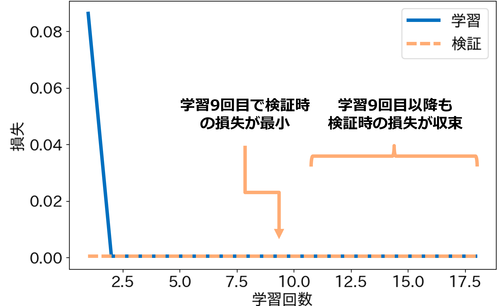

# Command Analyzer Seq2Seq - 学習方法について

## **各種ファイルについて**
- `scripts/network.py`  
    Seq2Seq(Sequence to Sequence)ネットワークのクラスが記述されたプログラム  

- `scripts/train.py`  
    実際に学習を行うプログラム  

- `scripts/test.py`  
    学習したモデルの命令理解精度をテストするプログラム  

- `scripts/predict.py`  
    学習したモデルで命令を理解するプログラム  

- `scripts/example.py`  
    命令理解のサンプルプログラム  
    
---

## **目次**
1. [学習する](#1-学習する)
2. [推論する](#2-推論する)

---

## 1. 学習する
学習を行う手順を説明します．
学習には`train.py`というプログラムを使用します．  
まず，データセットの指定とパラメータの設定を行います．

以下のファイルを編集します．
```bash
$ cd  ~/catkin_ws/src/command_analyzer/scripts/
$ gedit train.py
```

`train.py`の26行目以降のパラメータを編集します．  
30行目のエポック数の最大値は学習を上手く回すことが出来るか確認する際は`1`に設定し，確認が出来たら`100`に設定することをオススメします．  
31行目のバッチサイズは学習，検証，テストで使うデータセットそれぞれのデータサイズの公約数に設定する必要があります．
例えば，10000データを学習：検証：テスト=7:1:2で分割する場合，バッチサイズは1000，500，200，100などに設定することができます．
バッチサイズは小さいと学習にかかる時間が長くなり，1つ1つのデータに対する反応が上がり，細部に敏感な学習をします．
バッチサイズは大きいと学習にかかる時間が短くなり，1つ1つのデータに対する反応が下がり，大枠で捉えた学習をします．
また，バッチサイズが大きすぎるとPCのスペックによってはメモリ不足になる可能性もあります．
このようなトレードオフがあるため，都度調整をして学習することをオススメします． 

39-43行目のフラッグは各種必要に応じて切り替えて下さい．

45, 46行目にはデータセットのパスを設定します．
学習時とテスト時でデータセットが異なる場合は，test_pathにもパスを設定します．
1つのデータセットを学習時とテスト時に分けて用いる場合，あるいはテストを行わない場合はtest_pathは`None`と設定します．  
47行目にはモデルのパスを設定します．モデルを保存する際は，`/model/${モデルパス}/`の階層下に保存されます．

```train.py
class CommandAnalyzer():
    def __init__(self) -> None:
        self.device = torch.device("cuda:0" if torch.cuda.is_available() else "cpu")
        # パラメータ設定
        self.sen_length = 30
        self.output_len = 20
        self.max_epoch = 100                    # エポック数(学習回数)の最大値
        self.batch_size = 746                   # バッチサイズ(同時に学習するデータの数)
        self.wordvec_size = 300
        self.hidden_size = 650
        self.dropout = 0.5
        self.learning_rate = 0.001
        self.max_grad = 0.25
        self.eval_interval = 20
        self.early_stoping = 10

        self.is_debug = True                    # デバッグ用の出力をするかのフラッグ
        self.is_save_vec = False                # 辞書ベクトルを保存するかどうかのフラッグ
        self.is_save_model = False              # 学習モデルを保存するかどうかのフラッグ
        self.is_test_model = True               # モデルのテストを行うかどうかのフラッグ
        self.is_predict_unk = False             # 推論時に未知語を変換するかどうかのフラッグ

        self.train_path = '37300.txt'           # データセットのパス
        self.test_path = None                   # 学習データと別のデータセットでテストを行う際のデータセットのパス
        self.model_path = "example"             # モデルを保存する際のパス
        self.text_vocab_path = "text_vocab.pth"
        self.label_vocab_path = "label_vocab.pth"
        self.vectors=GloVe(dim=300)                 # GloVe(dim=300) or FastText(language="en")
        
```

`train.py`を実行します．
```bash
$ cd  ~/catkin_ws/src/command_analyzer/scripts/
$ python3 train.py
```

実行すると，学習が始まります．
学習中は以下のような損失グラフが表示されます．
損失の値が，学習時と検証時共に低い値で収束していたら学習成功です．

<div align="center"></div><br>

テストを行う場合，学習後に以下のような出力とAttentionマップが表示されます．
出力はテストデータの理解精度と，成功例10個，失敗例20個を示します．

<div align="center"></div><br>

Attentionマップは各出力をする際に入力文中のどの単語に注目をしていたかを示すものです．
上部のカラーバーに示すように，マスの色が明るければ明るいほど，その単語に注目をしていることを示しています．
この結果から正しい学習・注目による命令理解が出来ているか考察することができます．

<div align="center"></div><br>

## 2. 推論する
推論を行う手順を説明します．
推論の方法は2種類あります．  
1つ目は，テストデータを用いて推論精度の評価を行う方法です．
この方法は，学習時のプログラムにおけるテストと同じ処理を行います．
テストには`test.py`というプログラムを使用します．

`test.py`の27行目以降のパラメータを編集します．  
30行目のバッチサイズを学習時と同じ値に設定します．
これが学習時と異なる場合，ネットワーク内の構成が崩れるため，上手く動作しません．
これは，ネットワークに用いるパラメータであれば全て同様です．

40行目は推論するデータセットのパスを設定します．
42行目は読み込むモデルのパスを設定します．
43行目は読み込むモデルのエポック数を設定します．
特に理由がない限りは，保存されているモデルの中で一番大きいエポック数を設定しましょう．

```test.py
class CommandAnalyzer():
    def __init__(self) -> None:
        self.device = torch.device("cuda:0" if torch.cuda.is_available() else "cpu")
        # パラメータ設定
        self.sen_length = 30
        self.output_len = 20
        self.batch_size = 746                  # バッチサイズ(同時に学習するデータの数)
        self.wordvec_size = 300
        self.hidden_size = 650
        self.dropout = 0.5
        self.max_grad = 0.25
        self.eval_interval = 20

        self.is_debug = True
        self.is_predict_unk = False

        # モデルのパス
        self.test_path = '37300.txt'            # データセットのパス
        self.dir_path = os.path.join(os.path.dirname(os.path.abspath(__file__)), '..')
        self.model_path = "example"             # 保存したモデルのパス
        self.model_num = 17                     # 保存したモデルのエポック数
        self.encoder_path = "{}/model/{}/encoder_epoch{}.pth".format(self.dir_path, self.model_path, self.model_num)
        self.decoder_path = "{}/model/{}/decoder_epoch{}.pth".format(self.dir_path, self.model_path, self.model_num)
        self.text_vocab_path = "{}/model/{}/text_vocab.pth".format(self.dir_path, self.model_path, self.model_path)
        self.label_vocab_path = "{}/model/{}/label_vocab.pth".format(self.dir_path, self.model_path)
```

`test.py`を実行します．
```bash
$ cd  ~/catkin_ws/src/command_analyzer/scripts/
$ python3 test.py
```
実行結果は，`test.py`のテスト行こうと同じであるため割愛します．

2つ目は，入力された命令文を理解(推論)する方法です．
この方法は，推論の処理を関数化して行います．
推論には`predict.py`というプログラムを使用します．

`predict.py`の23行目以降のパラメータを編集します．  
26行目のバッチサイズを学習時と同じ値に設定します．
これが学習時と異なる場合，ネットワーク内の構成が崩れるため，上手く動作しません．
これは，ネットワークに用いるパラメータであれば全て同様です．

39行目は読み込むモデルのパスを設定します．
40行目は読み込むモデルのエポック数を設定します．
特に理由がない限りは，保存されているモデルの中で一番大きいエポック数を設定しましょう．


```predict.py
class CommandAnalyzer():
    def __init__(self) -> None:
        self.device = torch.device("cuda:0" if torch.cuda.is_available() else "cpu")
        # パラメータ設定
        self.sen_length = 30
        self.output_len = 20
        self.batch_size = 746                  # バッチサイズ(同時に学習するデータの数)
        self.wordvec_size = 300
        self.hidden_size = 650
        self.dropout = 0.5
        self.learning_rate = 0.001
        self.momentum=0
        self.max_grad = 0.25
        self.eval_interval = 20
        self.predict_unk = True
        self.show_attention_map = True

        # モデルのパス
        self.model_path = "gpsr_2013"
        self.dir_path = os.path.join(os.path.dirname(os.path.abspath(__file__)), '..')
        self.encoder_path = "{}/model/{}/encoder.pth".format(self.dir_path, self.model_path)
        self.decoder_path = "{}/model/{}/decoder.pth".format(self.dir_path, self.model_path)
        self.text_vocab_path = "{}/model/{}/text_vocab.pth".format(self.dir_path, self.model_path)
        self.label_vocab_path = "{}/model/{}/label_vocab.pth".format(self.dir_path, self.model_path)
```


関数としての使い方は154行目以降に記載しています．
この例では，158行目で受け取ったした命令文の理解を行います．

プログラムに書き込む際はこの書き方を参考にして下さい．
```predict.py
if __name__ == "__main__":
    command_analyzer = CommandAnalyzer()    
    while True:
        try:
            input_str = input("please input command >>")
            # input_str = "bring me the carlsberg in the living room"
            print(input_str)
            result =command_analyzer.predict(input_str)
            print(result)
            break
        except KeyboardInterrupt:
            break

```

`predict.py`を実行します．
```bash
$ cd  ~/catkin_ws/src/command_analyzer/scripts/
$ python3 predict.py
```

実行すると，以下のような出力が得られます．
この例では，`bring me the coke in the living room`という命令文を入力しています．
プログラムは`Ctrl+C`で終了することができます．


<div align="center"></div><br>

<br>


