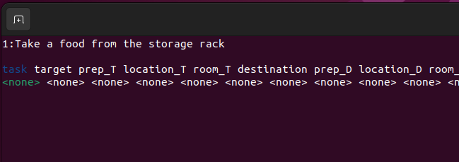

# Command Analyzer Seq2Seq - 学習方法について

## **各種ファイルについて**
- `data/create_label.py`  
    正解ラベルを作成するためのプログラム  

- `data/key_direct.py`  
    `create_label.py`のキーボード入力を受け取るプログラム  

- `data/annonymize_dataset.py`  
    データセット増量のために，単語を種類ごとに匿名化するプログラム  

- `data/increase_dataset.py`  
    匿名化した単語を入れ替えることでデータセットを増量するプログラム  

- `data/trim_dataset.py`  
    データセットのサイズをトリミングするプログラム  

---

## **目次**
1. [学習する](#1-学習する)
2. [推論する](#2-推論する)
3. [プログラムに組み込む](#3-プログラムに組み込む)

---

## 1. 学習する
学習時の入力となるテキストデータの作成手順を説明します．
今回の例では，[RoboCup@Home Sydney2019のGPSRのコマンドジェネレータ](https://github.com/RoboCupAtHome/Sydney2019)を使用してテキストデータを作成します．
Handyman等，別競技のデータを使いたい場合は別途用意して下さい．

Windows用の実行ファイル(.exeファイル)をUbuntuで実行するためのリポジトリをインストールします．

```bash
$ sudo apt update
$ sudo apt install mono-complete
```

コマンドジェネレータを実行します．
```bash
$ cd  ~/catkin_ws/src/command_analyzer_seq2seq/data/GPSRCmdGen
$ mono GPSRCmdGen.exe
```

実行すると，以下のような出力がされます．Enterキーを押すたびにコマンドが生成されるので，適当なtxtファイルにコピー＆ペーストしましょう．今回の例では，`command.txt`というファイルに保存します．


## 2. 推論する
テキストデータに正解ラベルをつける手順を説明します．
正解ラベルの作成には，`create_label.py`というプログラムを使用します．  
まず，テキストデータのファイルと保存するファイルの設定を行います．

以下のファイルを編集します．
```bash
$ cd  ~/catkin_ws/src/command_analyzer_seq2seq/data/
$ gedit create_label.py
```

`create_label.py`の25, 26行目を読み込むファイル名と書き込むファイル名に書き換えます.
28行目の設定は正解ラベルを新規作成する場合`create`，一度正解ラベルがついたファイルを修正する場合`fix`にして下さい．
```create_label.py
data = {}
increase_data = {}
read_file_name = "command.txt"      # << ここを書き換える
write_file_name = "dataset.txt"     # << ここを書き換える

cmd_type = "create"                 # create or fix
```

`create_label.py`を実行します．
```bash
$ cd  ~/catkin_ws/src/command_analyzer_seq2seq/data/
$ python3 create_label.py
```
実行すると，以下のような出力がされます．操作は上下左右キーとEnterキーで行います．  
左右キーで情報の種類を選択します．
上下キーで選択している情報の正解ラベルを変更します．  
全ての情報にラベルをつけ終えたら，Enterキーを押すことで次のコマンドに移動します．  

<div align="center"></div><br>

※正解ラベルの選択肢は`lib/lists.py`を編集することで追加することが出来ます．

`create_label.py`のプログラムは`Ctrl＋C`で中断することが出来ます．  
次回`create_label.py`を実行する際に途中から再開することが出来ます．  
<br>

## 3. プログラムに組み込む
作成したデータセットを増量する手順を説明します．まず，データセット増量の前処理として，単語の匿名化を行います．
単語の匿名化には，`annonymize_dataset.py`を使用します．

`annonymize_dataset.py`の10, 11行目を読み込むファイル名と書き込むファイル名に書き換えます.
```annonymize_dataset.py
from lib import lists, dicts

read_file_name = "dataset.txt"                  # << ここを書き換える
write_file_name = "annonymized_dataset.txt"     # << ここを書き換える

person_names = lists.person_names
```

`annonymize_dataset.py`を実行します．
```bash
$ cd  ~/catkin_ws/src/command_analyzer_seq2seq/data/
$ python3 annonymize_dataset.py
```

次に，データセットの増量を行います．
データセットの増量には，`increase_dataset.py`を使用します．

`increase_dataset.py`の12, 13行目を読み込むファイル名と書き込むファイル名に書き換えます.
```increase_dataset.py
from tqdm import tqdm

read_file_name = "annonymized_dataset.txt"      # << ここを書き換える
write_file_name = "increased_dataset.txt"       # << ここを書き換える

person_names = lists.person_names
```

`increase_dataset.py`を実行します．
```bash
$ cd  ~/catkin_ws/src/command_analyzer_seq2seq/data/
$ python3 increase_dataset.py
```

<br>

